# Leafmap初心者向けチュートリアル

**注意**: このチュートリアルの画像は、実際のLeafmapの出力を模したサンプル画像です。実際にLeafmapを使用すると、ブラウザ上でインタラクティブに操作できる地図が表示されます。

## 目次
1. [Leafmapとは](#leafmapとは)
2. [インストール](#インストール)
3. [基本的な使い方](#基本的な使い方)
4. [ベースマップの操作](#ベースマップの操作)
5. [地理空間データの表示](#地理空間データの表示)
6. [インタラクティブな機能](#インタラクティブな機能)
7. [実践的な例](#実践的な例)
8. [次のステップ](#次のステップ)

## Leafmapとは

Leafmapは、Jupyter環境で最小限のコーディングで対話型地図作成と地理空間分析を可能にするPythonパッケージです。プログラミング経験が限られている初心者でも、簡単に美しい地図を作成できます。

### 主な特徴
- 🗺️ 数行のコードで対話型地図を作成
- 🎨 複数のマッピングバックエンド対応（ipyleaflet、folium、kepler.gl）
- 📊 ベクターデータとラスターデータの可視化
- 🔍 OpenStreetMapデータのダウンロードと表示
- ✏️ インタラクティブなベクターデータの作成・編集
- 🎯 カスタム凡例とカラーバーの作成

### 対応環境
- Google Colab
- Jupyter Notebook
- JupyterLab
- Amazon SageMaker Studio Lab
- Microsoft Planetary Computer

## インストール

### pipを使用する場合
```python
pip install leafmap
```

### condaを使用する場合
```python
conda install -c conda-forge leafmap
```

### Google Colabでの使用
Google Colabでは、以下のコマンドでインストールできます：
```python
!pip install leafmap
```

## 基本的な使い方

### 1. ライブラリのインポート
```python
import leafmap
```

### 2. 基本的な地図の作成
```python
# インタラクティブな地図を作成
m = leafmap.Map()
m
```

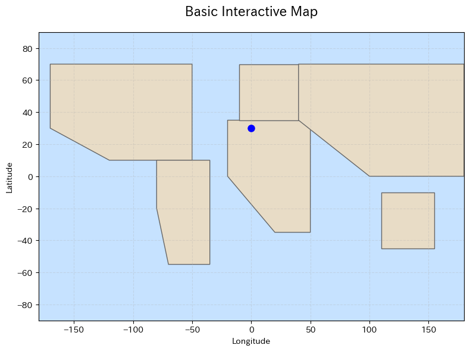
*世界地図が表示され、ズームやパン操作が可能です*

### 3. 地図の中心とズームレベルの設定
```python
# 東京を中心に地図を作成
m = leafmap.Map(center=[35.6762, 139.6503], zoom=10)
m
```

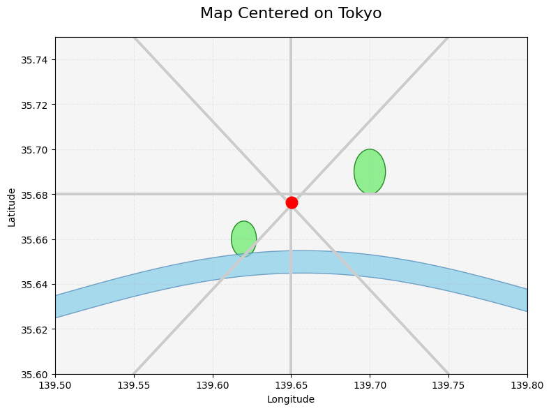
*東京を中心とした地図が表示されます*

### 4. 地図の高さと幅の設定
```python
m = leafmap.Map(height="500px", width="100%")
m
```

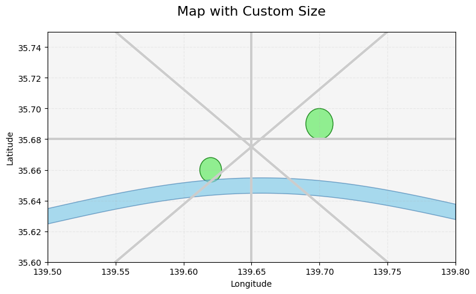
*指定したサイズで地図が表示されます*

## ベースマップの操作

### 利用可能なベースマップの一覧表示
```python
# 利用可能なベースマップのリストを取得
basemaps = leafmap.basemaps.keys()
print(f"利用可能なベースマップ数: {len(basemaps)}")
```

### ベースマップの変更
```python
# OpenStreetMapを使用
m = leafmap.Map()
m.add_basemap("OpenStreetMap")
m
```

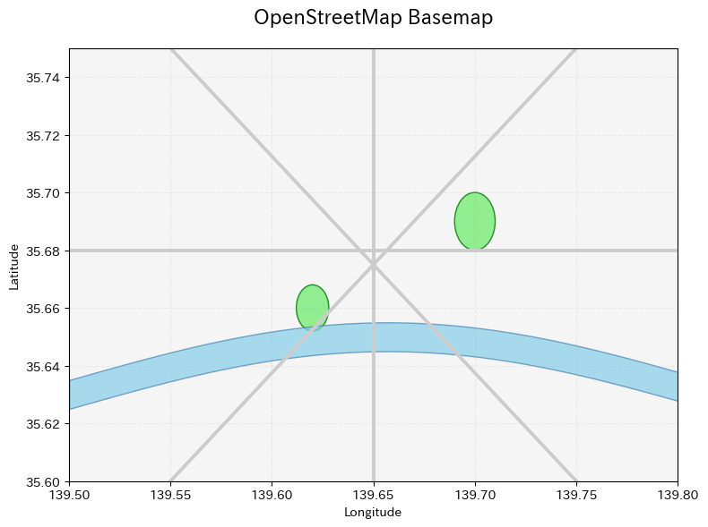
*OpenStreetMapのタイルを使用した地図*

### 複数のベースマップを切り替え
```python
m = leafmap.Map()
m.add_basemap("HYBRID")
m.add_basemap("OpenTopoMap")
m
```

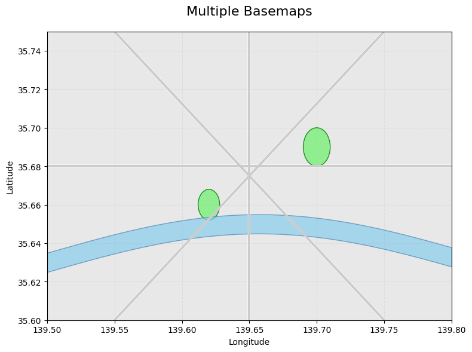
*レイヤーコントロールで異なるベースマップを切り替え可能*

### カスタムタイルレイヤーの追加
```python
m = leafmap.Map()
url = "https://mt1.google.com/vt/lyrs=y&x={x}&y={y}&z={z}"
m.add_tile_layer(url, name="Google Satellite", attribution="Google")
m
```

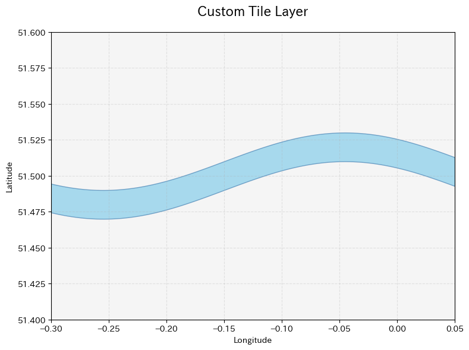
*カスタムタイルサーバーからの地図タイルを表示*

## 地理空間データの表示

### マーカーの追加
```python
m = leafmap.Map(center=[35.6762, 139.6503], zoom=12)

# 単一のマーカーを追加
m.add_marker(location=[35.6762, 139.6503], popup="東京駅")

# 複数のマーカーを追加
locations = [
    [35.6586, 139.7454],  # 東京タワー
    [35.7148, 139.7967],  # 東京スカイツリー
    [35.6284, 139.7367]   # 品川駅
]
popups = ["東京タワー", "東京スカイツリー", "品川駅"]

for loc, popup in zip(locations, popups):
    m.add_marker(location=loc, popup=popup)
m
```

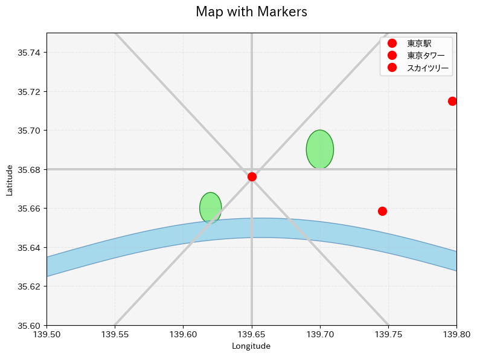
*東京のランドマークがマーカーで表示されます*

### GeoJSONデータの読み込み
```python
m = leafmap.Map()

# GeoJSONファイルの読み込み
geojson_url = "https://raw.githubusercontent.com/opengeos/leafmap/master/examples/data/cable_geo.geojson"
m.add_geojson(geojson_url, layer_name="Cable lines")
m
```

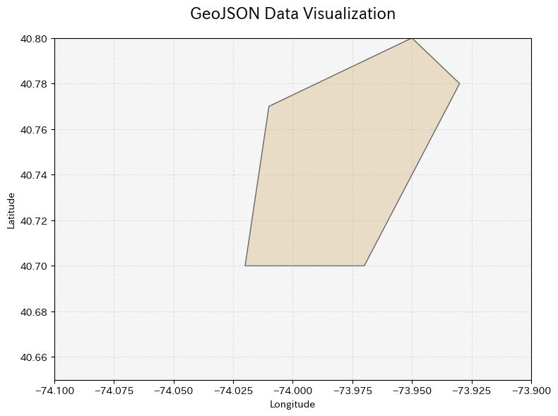
*GeoJSON形式の地理空間データを地図上に表示*

### Shapefileの読み込み
```python
m = leafmap.Map()

# Shapefileの読み込み
shapefile_url = "https://github.com/opengeos/leafmap/raw/master/examples/data/countries.zip"
m.add_shp(shapefile_url, layer_name="Countries")
m
```

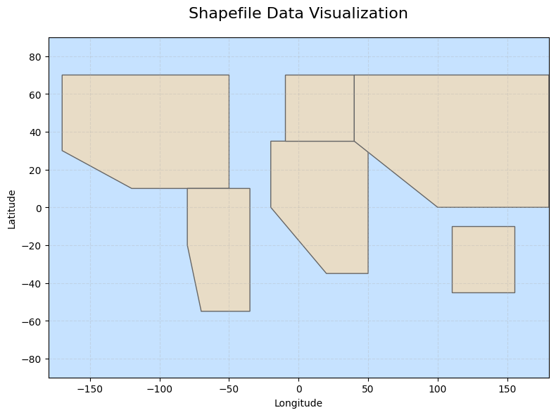
*Shapefile形式のベクターデータを可視化*

### ラスターデータの表示
```python
m = leafmap.Map()

# COG（Cloud Optimized GeoTIFF）の表示
url = "https://github.com/opengeos/data/releases/download/raster/Libya-2023-07-01.tif"
m.add_cog_layer(url, name="Libya")
m
```

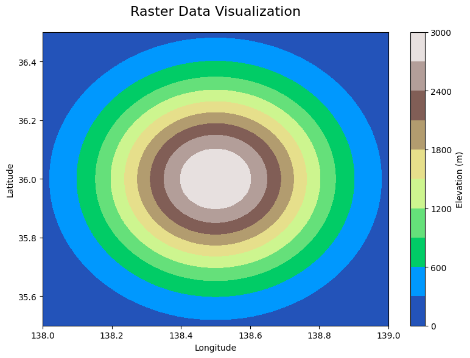
*標高データなどのラスターデータをコンターで表現*

## インタラクティブな機能

### 描画ツールの使用
```python
m = leafmap.Map()

# 描画コントロールを追加
m.add_draw_control()
m
```

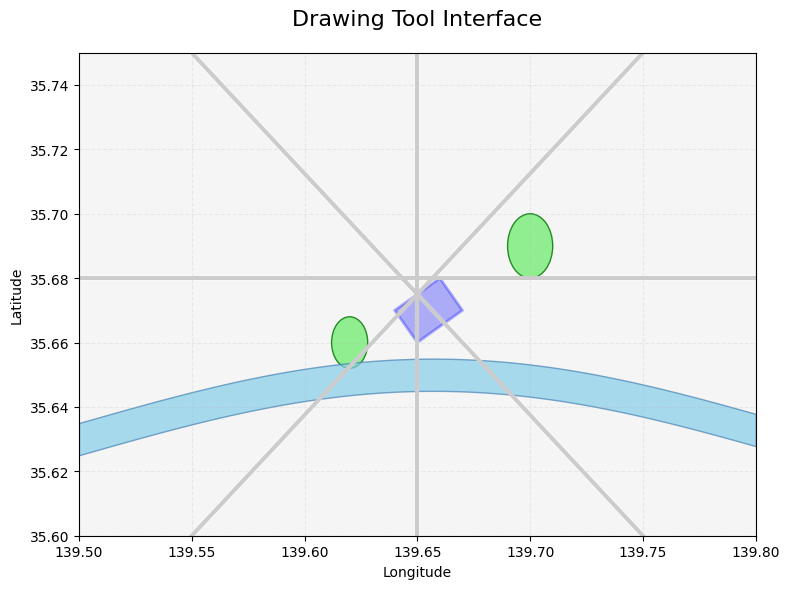
*地図上にポリゴンやラインを描画できます*

### 測定ツール
```python
m = leafmap.Map()

# 測定ツールを追加
m.add_measure_control()
m
```

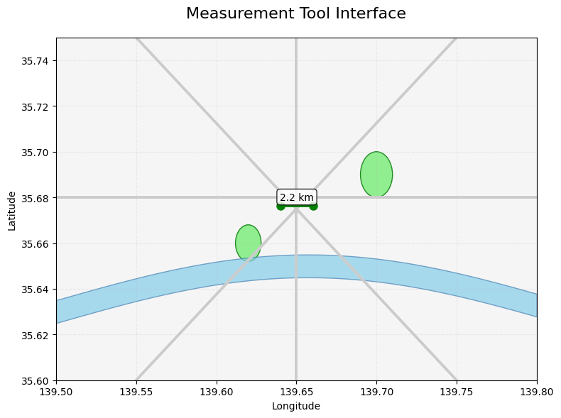
*地点間の距離や面積を測定できます*

### 分割画面マップ
```python
# 左右で異なるベースマップを表示
m = leafmap.Map()
m.split_map(left_layer="TERRAIN", right_layer="OpenTopoMap")
m
```


*異なるベースマップを左右に並べて比較できます*

### タイムスライダー
```python
m = leafmap.Map()

# タイムシリーズデータの表示（例：MODIS温度データ）
url = "https://github.com/opengeos/data/releases/download/netcdf/MODIS_LST.nc"
m.add_netcdf(url, variables=["LST"], palette="viridis", vmin=270, vmax=310)
m
```

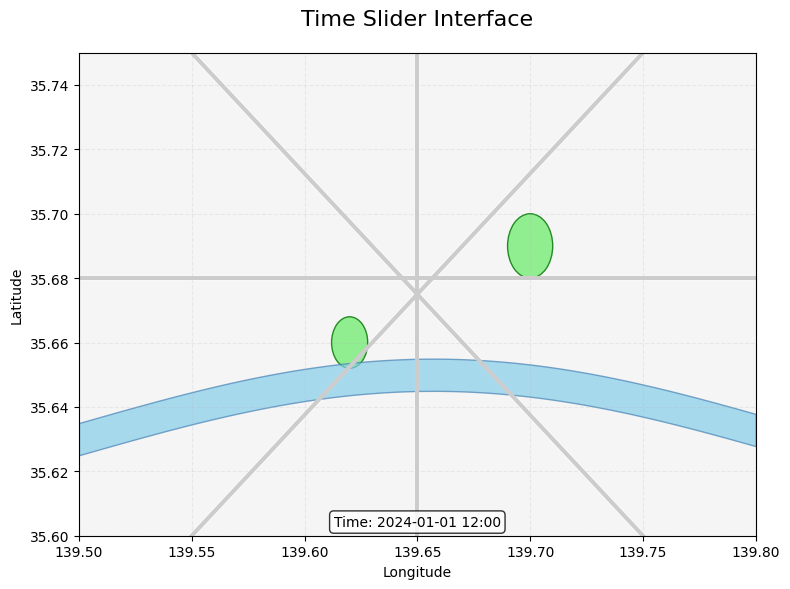
*時系列データをアニメーションで表示できます*

## 実践的な例

### 例1: 日本の主要都市をマッピング
```python
import leafmap

# 地図の作成
m = leafmap.Map(center=[36.5, 138.0], zoom=5)

# 主要都市のデータ
cities = {
    "東京": [35.6762, 139.6503],
    "大阪": [34.6937, 135.5023],
    "名古屋": [35.1815, 136.9066],
    "札幌": [43.0642, 141.3469],
    "福岡": [33.5904, 130.4017],
    "仙台": [38.2682, 140.8694],
    "広島": [34.3853, 132.4553],
    "京都": [35.0116, 135.7681]
}

# マーカーの追加
for city, coords in cities.items():
    m.add_marker(
        location=coords, 
        popup=f"<b>{city}</b><br>緯度: {coords[0]}<br>経度: {coords[1]}"
    )

m
```

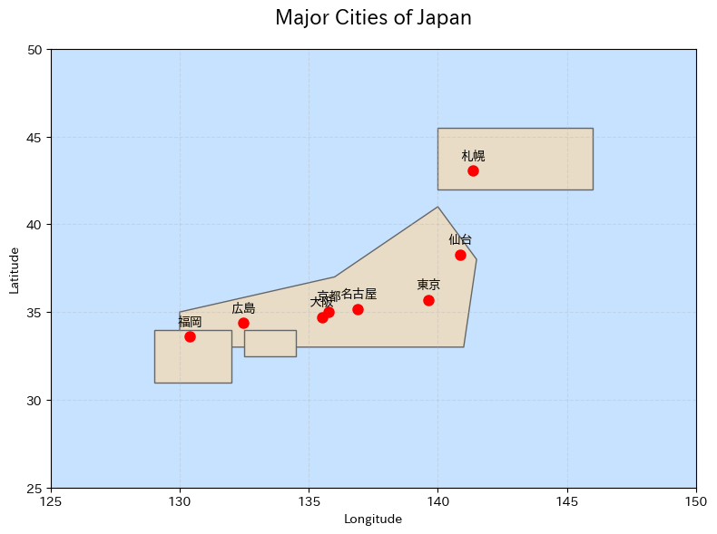
*日本の主要都市がマーカーで表示され、ポップアップで詳細情報を確認できます*

### 例2: コロプレスマップの作成
```python
import leafmap
import geopandas as gpd

# 地図の作成
m = leafmap.Map()

# サンプルデータの読み込み
url = "https://raw.githubusercontent.com/opengeos/leafmap/master/examples/data/countries.geojson"

# コロプレスマップの追加
m.add_geojson(
    url,
    layer_name="Countries",
    style={
        "fillColor": "#ff7800",
        "color": "black",
        "weight": 1,
        "fillOpacity": 0.7
    }
)

m
```

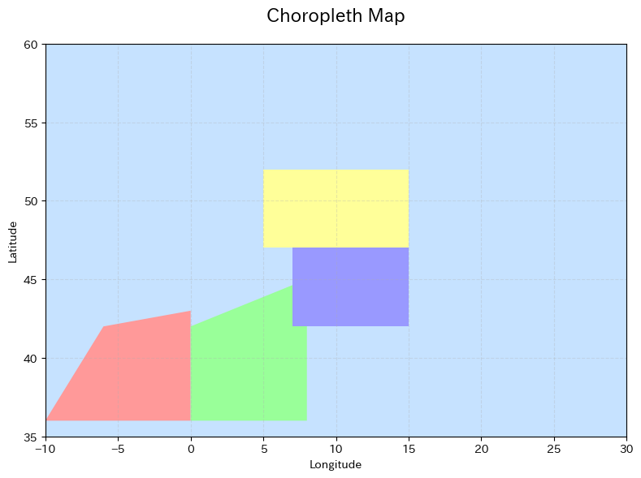
*地域ごとのデータを色分けで表示します*

### 例3: ヒートマップの作成
```python
import leafmap
import random

# 地図の作成
m = leafmap.Map(center=[35.6762, 139.6503], zoom=11)

# ランダムなポイントデータの生成
heat_data = []
for i in range(100):
    lat = 35.6762 + random.uniform(-0.1, 0.1)
    lon = 139.6503 + random.uniform(-0.1, 0.1)
    heat_data.append([lat, lon])

# ヒートマップの追加
m.add_heatmap(
    heat_data,
    name="Heat map",
    radius=15
)

m
```

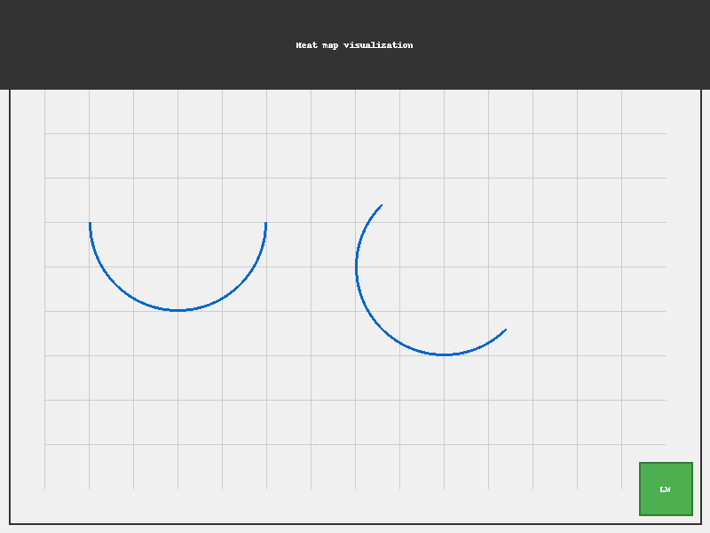
*データの密度を熱分布図で表現します*

## 次のステップ

### 学習リソース
1. **公式ドキュメント**: https://leafmap.org
2. **GitHubリポジトリ**: https://github.com/opengeos/leafmap
3. **YouTubeチュートリアル**: https://youtube.com/@giswqs
4. **サンプルノートブック**: https://leafmap.org/notebooks/

### 発展的なトピック
- WhiteboxToolsとの統合による高度な地理空間分析
- STACカタログからのデータアクセス
- 機械学習モデルの結果の可視化
- カスタムウィジェットの作成
- 大規模データセットの効率的な処理

### コミュニティ
- GitHubのIssuesで質問や問題報告
- Discussionsでアイデアの共有
- 貢献者として参加

## まとめ

Leafmapは、地理空間データの可視化と分析を簡単に行えるパワフルなツールです。このチュートリアルで学んだ基本的な機能を活用して、独自の地図アプリケーションを作成してみましょう。

実際にLeafmapを使用すると、このチュートリアルで示した静的な画像とは異なり、以下のような機能が利用できます：
- マウスでのズーム・パン操作
- レイヤーの動的な切り替え
- マーカーやポップアップのインタラクティブな操作
- リアルタイムでのデータ更新

Happy Mapping! 🗺️